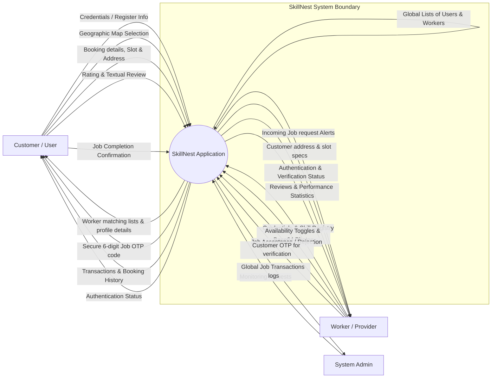
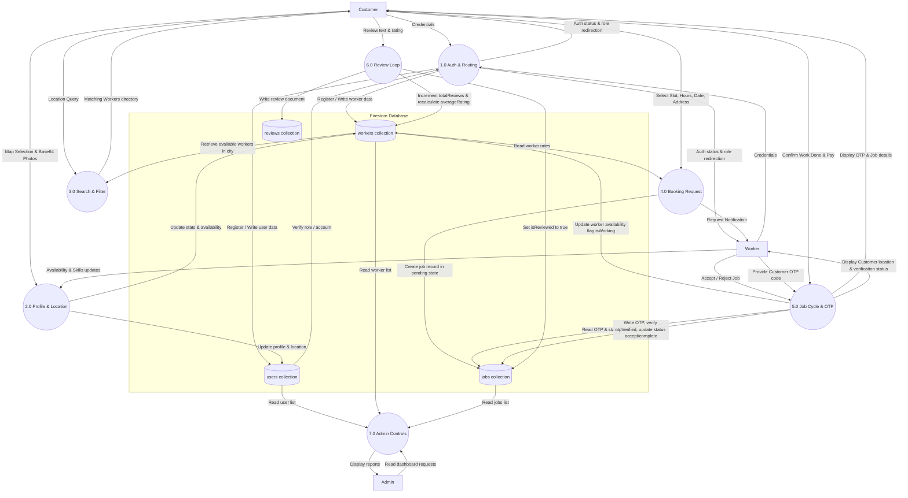

# Data Flow Diagrams (DFD)
## Project: SkillNest

This document contains Data Flow Diagrams illustrating how data enters, flows through, is stored in, and leaves the SkillNest platform.

---

## 1. DFD Level 0 (Context Diagram)

The Context Diagram defines the system boundary, showing the high-level input and output data flows between the **SkillNest System** and external entities (**Customer**, **Worker**, and **Admin**).

### Mermaid Diagram

---

## 2. DFD Level 1 (Process Decomposition)

The Level 1 DFD decomposes the system into specific sub-processes and explicitly maps their reads and writes to the data stores (Firestore Collections: `users`, `workers`, `jobs`, `reviews`).

### Mermaid Diagram

---

## 3. Data Dictionary Summary

| Data Flow / Element | Origin | Destination | Description |
| :--- | :--- | :--- | :--- |
| **Credentials** | Customer / Worker | Process 1.0 | Email, password, and registration attributes (name, role). |
| **Profile Data** | Customer / Worker | Process 2.0 | Base64 profile picture strings, phone updates, and name updates. |
| **Geographic coordinates** | Map Picker UI | Process 2.0 | Lat/Long coordinates translated into city names via geocoding. |
| **Job Request Specs** | Customer | Process 4.0 | Date, hourly charges, slot times, client address, and total price. |
| **Verification OTP** | Process 5.0 / jobs collection | Customer | 6-digit random code shown on Customer screen. |
| **OTP Entry** | Worker | Process 5.0 | Code submitted by worker to verify physical presence on-site. |
| **Review Payload** | Customer | Process 6.0 | Rating integer (1-5), feedback comments, and job id. |
