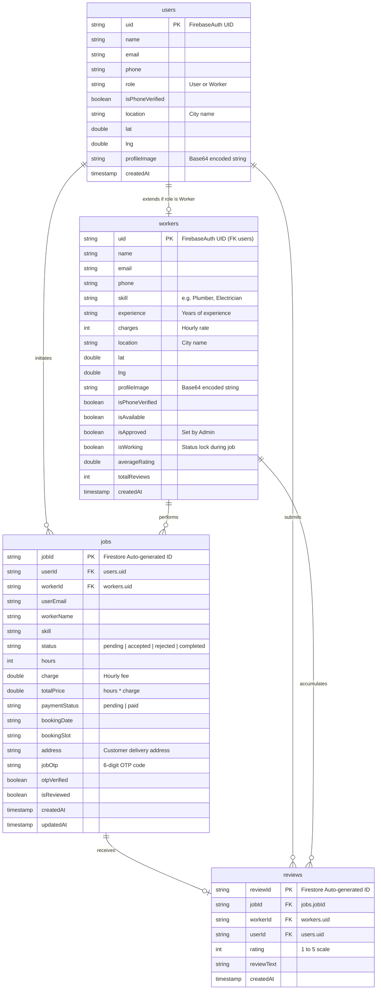

# Entity-Relationship (ER) Diagram
## Project: SkillNest

This document contains the Entity-Relationship Diagram for SkillNest, illustrating the Firestore collection models, their schema definitions, and relationship cardinalities.

### Mermaid Diagram

### Logical Relationships Description

1. **Users and Workers (`1:0..1` relationship)**:
   - Every registered account has a corresponding document in the `users` collection.
   - If the account role is selected as `"Worker"`, a corresponding document is also created in the `workers` collection sharing the identical `uid` to store skill directories, charges, and status flags.

2. **Users and Jobs (`1:N` relationship)**:
   - A Customer (`user`) can book multiple jobs (`N`) over time.
   - Each job document stores the Customer's identifier (`userId`) to link back to the specific user profile.

3. **Workers and Jobs (`1:N` relationship)**:
   - A `worker` can be requested for and execute multiple jobs (`N`).
   - The job document contains the worker's identifier (`workerId`) to track assignments.

4. **Jobs and Reviews (`1:0..1` relationship)**:
   - Each individual job can have at most one associated review, completed post-delivery to prevent duplicate feedback loops (`isReviewed` status flag on `jobs` toggles from `false` to `true`).

5. **Users/Workers and Reviews (`1:N` relationship)**:
   - A Customer (`user`) submits reviews across various bookings.
   - A `worker` accumulates multiple review objects which dynamically update their `averageRating` and `totalReviews` aggregates via database transactions.
