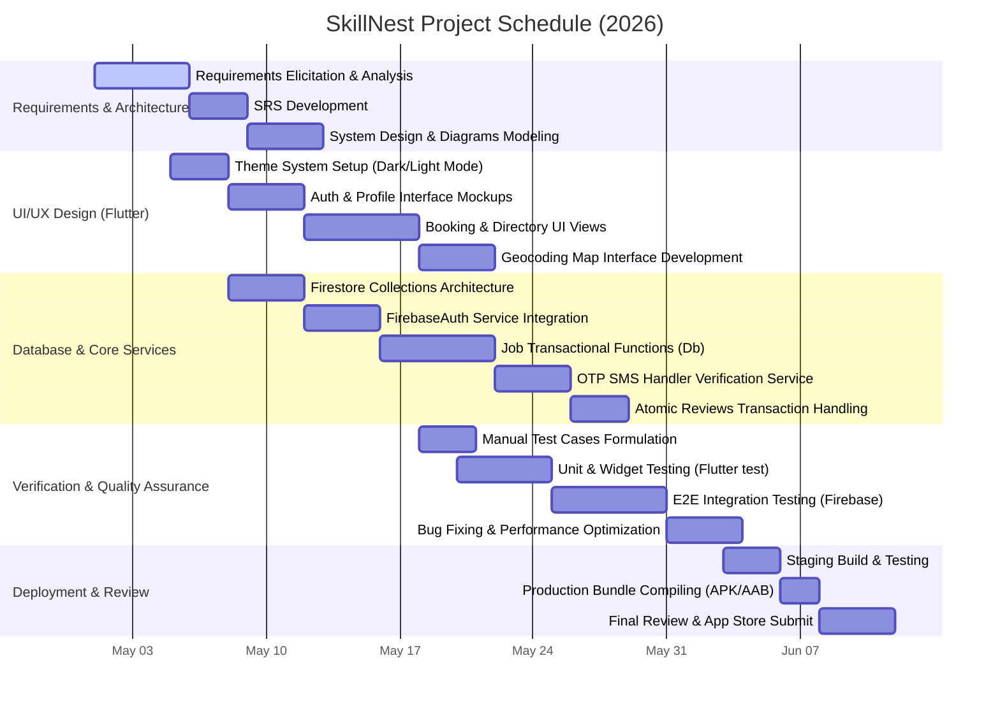

# Project Gantt Chart
## Project: SkillNest

This document contains a Gantt Chart representing the development phases, tasks, dependencies, and timeline of the SkillNest project.

### Mermaid Diagram

### Schedule Phase Breakdown

1. **Requirements & Architecture (May 1 – May 12)**:
   - Defining core customer-worker search scopes, role structures, and document schemas.
   - Drawing blueprints: Use Cases, Entity-Relationships, Data Flow Diagrams (Context & Level 1), and Sequence flows.

2. **UI/UX Design (May 5 – May 22)**:
   - Establishing design systems supporting Light/Dark themes.
   - Crafting responsive customer lookup grids, worker job management tabs, and embedding interactive maps (OpenStreetMap).

3. **Database & Core Services (May 8 – May 29)**:
   - Building Firestore integrations, writing transactional operations for atomic ratings increments, implementing OTP authentication sequences, and configuring lock structures (`isWorking` flag).

4. **Verification & Quality Assurance (May 18 – Jun 3)**:
   - Writing test case tables.
   - Conducting unit tests on services and manual regression testing on user workflows (Signups, locations, and OTP triggers).

5. **Deployment & Review (Jun 3 – Jun 12)**:
   - Bundling Android installation packages, resolving environment overrides, and preparing submission materials.
