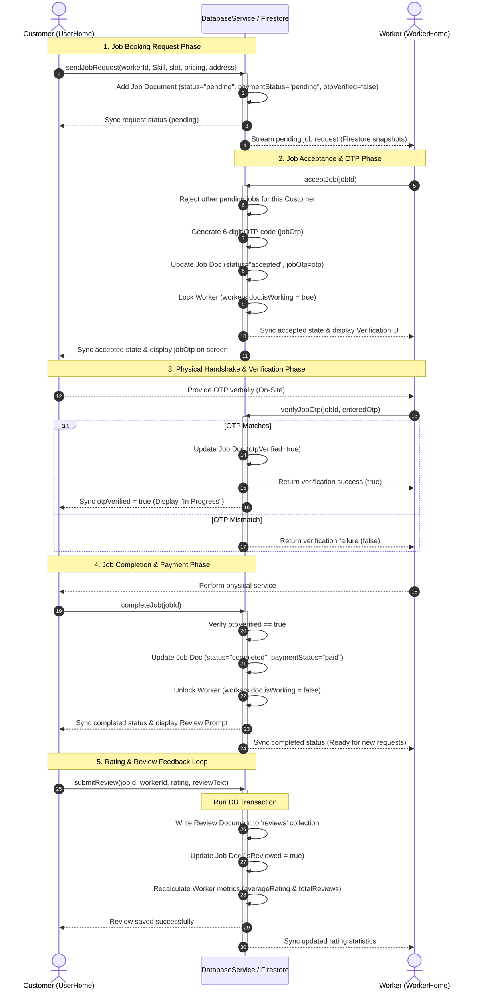

# Sequence Diagram
## Project: SkillNest

This Sequence Diagram represents the transactional workflow of **Job Booking, OTP Security Handshake, Work Verification, Job Completion, and Reviews**.

### Mermaid Diagram

### Workflow Execution Details

1. **Job Request (Steps 1–3)**:
   - The Customer selects a worker from the search tab and submits slot dates and rates. A document is created in the `jobs` collection with standard fields in a `"pending"` state.

2. **Job Acceptance (Steps 4–8)**:
   - The Worker receives real-time updates through Firestore snapshot listeners.
   - When the Worker accepts, any other pending job requests the Customer initiated are automatically marked as `"rejected"`.
   - A 6-digit random code is generated, and the Worker's `isWorking` status is set to `true`, taking them off the availability pool. The Customer's screen updates to display this OTP.

3. **OTP Security Verification (Steps 9–15)**:
   - The Worker meets the Customer at the booking location and requests the code.
   - Verification occurs inside a Firestore document update, ensuring that the worker cannot initiate/claim work without customer confirmation.

4. **Job Completion (Steps 16–21)**:
   - Once work concludes, the Customer flags the job as completed. This unlocks the Worker's status (`isWorking = false`), making them available in searches again.

5. **Reviews & Rating updates (Steps 22–25)**:
   - The customer submits feedback. A transaction reads the worker's current rating profile, averages it with the new rating, and writes the updated document fields atomically to prevent concurrency issues.
