# Use Case Diagram
## Project: SkillNest

This Use Case Diagram outlines the interactions between the system actors (**Customer**, **Worker**, and **Admin**) and the core functionalities provided by the SkillNest platform.

### Mermaid Diagram

```mermaid
graph TD
  %% Actor Definitions (Styled as Circles)
  Customer((Customer))
  Worker((Worker))
  Admin((Admin))

  %% System Boundary
  subgraph SkillNest System Boundary
    UC1(Register / Login Account)
    UC2(Update Details & Set Location)
    UC3(Upload Profile Picture)
    
    UC4(Search & Filter Available Workers)
    UC5(Request Job Booking & Calculate Fees)
    
    UC6(Accept or Reject Job Requests)
    UC7(Generate & Display Verification OTP)
    UC8(Enter OTP for On-Site Verification)
    
    UC9(Finalize Job & Confirm Payment)
    UC10(Submit Rating & Textual Review)
    UC11(View Transactions History)
    
    UC12(Monitor Registered Users & Workers)
    UC13(View Global Job Transactions)
  end

  %% Relationship Mappings (Actors to Use Cases)
  
  %% Customer Flow
  Customer --- UC1
  Customer --- UC2
  Customer --- UC3
  Customer --- UC4
  Customer --- UC5
  Customer --- UC7
  Customer --- UC9
  Customer --- UC10
  Customer --- UC11

  %% Worker Flow
  Worker --- UC1
  Worker --- UC2
  Worker --- UC3
  Worker --- UC6
  Worker --- UC8
  Worker --- UC11

  %% Admin Flow
  Admin --- UC1
  Admin --- UC12
  Admin --- UC13

  %% Styling nodes
  classDef actor fill:#f9f,stroke:#333,stroke-width:2px;
  classDef usecase fill:#dff,stroke:#333,stroke-width:1px;
  class Customer,Worker,Admin actor;
  class UC1,UC2,UC3,UC4,UC5,UC6,UC7,UC8,UC9,UC10,UC11,UC12,UC13 usecase;
```

### Descriptions of Core Use Cases

| ID | Use Case Name | Actor(s) | Description |
| :--- | :--- | :--- | :--- |
| **UC1** | Register / Login Account | Customer, Worker, Admin | Users create credentials and log in. The system identifies their role to determine their user workspace interface. |
| **UC2** | Update Details & Set Location | Customer, Worker | Users update profile fields. Setting coordinates on OpenStreetMap updates their location city string, enabling localized matches. |
| **UC3** | Upload Profile Picture | Customer, Worker | Compresses and saves base64 profile pictures within the user's registry document. |
| **UC4** | Search & Filter Workers | Customer | Customers view online, approved, and verified workers inside the customer's matching location city. |
| **UC5** | Request Job Booking | Customer | Customer specifies hours, booking date/slot, and address. The system calculates charges and forwards the request. |
| **UC6** | Accept or Reject Job | Worker | Worker reviews incoming request and decides whether to accept it. |
| **UC7** | Generate & Display OTP | Customer, System | Accepting a job triggers the system to generate a 6-digit `jobOtp`. The customer retrieves it from their UI. |
| **UC8** | Enter OTP for Verification | Worker, System | Worker inputs the code provided by the customer on-site to verify OTP, shifting status to active. |
| **UC9** | Finalize Job & Pay | Customer | Once the service is complete, the customer confirms, paying the fee and returning the worker to active availability. |
| **UC10**| Submit Rating & Review | Customer | Customer submits feedback, running a database transaction to calculate and update worker average rating and counts. |
| **UC11**| View Transactions History | Customer, Worker | Lists past, pending, and completed service receipts. |
| **UC12**| Monitor Users & Workers | Admin | Admin lists registered user accounts and details. |
| **UC13**| View Global Job Transactions | Admin | Admin monitors booking list logs. |
